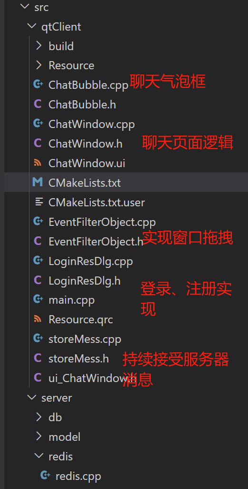
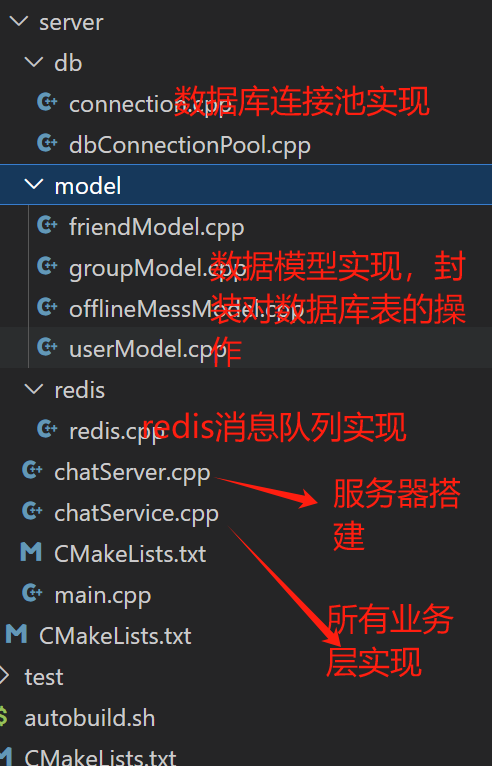

这个本人做的比较早，通过研究开源服务器项目完成的，这个项目很好的结合了我学的知识内容，完成项目也添加了不少自己的东西，尤其是Qt前端设计，Qt前端书写，在服务器上，本人也扩展了数据库连接池等技术，写着写着就写了2500+行代码了:happy::happy::happy::happy:，学习了很多，也成长了许多，现在发布源码，期待与大家一起流讨论。

## 项目文件解析

### 头文件

### 前端QT

### 服务器实现

## 数据连接池

### 连接池功能点介绍

#### 初始连接量

表示连接池事先会和 MySQL Serve r创建最小个数的连接，当应用发起 MySQL 访问时，不用再创建和 MySQL Server 新的连接，直接从连接池中**获取一个**可用的连接即可，**使用完成后并不去释放连接，而是把连接再归还到连接池当中**。

#### 最大连接量

当并发访问MySQL Server的请求增多时，初始连接量已经不够用了，此时会去**创建**更多的连接给应用去使用，**但**是新创建的连接数量上限是maxSize，**不能无限制**的创建连接。并且当这些连接使用完之后，再次**归还**到连接池当中来维护。

#### 最大空闲时间

当访问MySQL的并发请求多了以后，连接池里面的连接数量会动态增加，上限是maxSize 个，当这些连接用完会再次归还到连接池当中。如果在指定的时间内这些新增的连接都没有被再次使用过，那么新增加的这些连接资源就要被回收掉，**只需要保持初始连接量个连接即可**。

#### 连接超时时间

当MySQL的并发请求量过大，连接池中的连接数量已经到达最大数量了，而此时**没有空闲的连接可供使用**，那么此时应用从连接池获取连接无法成功，**它通过阻塞的方式获取连接的时间，如果超过一个时间，那么获取连接失败**。

### 连接池主要包含了以下功能点

- 单例模式设置连接池；
- 向用户提供一个接口，可以从池中拿到一个数据库连接；
- 采用生产者-消费者模式，池用队列作为缓冲区，实现生成连接和拿取连接；
- 采用锁，在创建、拿取连接中进行加锁；
- 采用智能指针管理从队列中获取的连接，并且采用lambda实现智能指针的析构函数，将连接从新放回队列中；
- 设置生产连接、回收连接线程，并且驻留后台，作为守护线程；
- 采用原子变量才记录当前池中的连接数。

## 网络模块

采用`muduo::net`搭建服务器。

~~~cpp
#ifndef CHATSERVER_H_
#define CHATSERVER_H_

#include <muduo/net/TcpServer.h>
#include <muduo/net/EventLoop.h>
#include <string>

class ChatServer
{
public:
    // 初始化服务器
    ChatServer(muduo::net::EventLoop* loop, const muduo::net::InetAddress& listenAddr, const std::string& nameArg);

    // 启动服务器
    void start();
private:  
    // 连接、读写回调
    void onConnection(const muduo::net::TcpConnectionPtr& conn);
    void onMessage(const muduo::net::TcpConnectionPtr& conn, muduo::net::Buffer* buffer, muduo::Timestamp receiveTime);

    muduo::net::TcpServer m_server;
    muduo::net::EventLoop* m_loop;
};

#endif // !CHATSERVER_H_
~~~

这个用过muduo的都知道，这个是一个固定的流程。

## 业务与数据模型设置

==采用分层思想==，网络和业务分离的方式，不同的业务对应不同的数据模型(含有两个类：一个作为数据对象，存储从数据库对应表的字段数据他，并且提供get、set方法，另外一个封装操作数据库代码，实现对数据库的增删改查)。

==数据模块：==

采用`ORM`思想，给每一个业务处理分配一个`id`，这样在网络模块中，客户端发送消息有一个消息`id`，这样服务器根据不同的`id`，将调用不同的**业务处理**；**对于不同模块**，创建两个类：

- 实体类：存储实体的属性、`set和get`函数(当然`java`可以自动实现)；
- Model类：封装`SQL`语句，并且与数据库交互，实现信息更新。

==业务模块==：

- 单例模式

- 存储数据操作对象
- 储存消息id和对应的业务处理函数

==响应消息模块==：

采用消息映射的方法，通过客户端发送不同的业务，调用不同的方法。

## 用户登录和注册模块

实体、属性：

==其中==：

| 字段名称 |         字段类型          |   字段说明   |     约束      |
| :------: | :-----------------------: | :----------: | :-----------: |
|    id    |            INT            |    用户id    | 主键、自增长  |
|   name   |        VARCHAR(50)        |    用户名    |  唯一、非空   |
| password |        VARCHAR(50)        |     密码     |     非空      |
|  state   | ENUM(‘online’, ‘offline’) | 当前登录状态 | 默认‘offline’ |

==难点、注意点==：

- 客户端退出、服务器退出，数据库用户状态需要修改；
- 记录用户连接信息，要注意线程安全问题，因为muduo库是多线程的。

## 一对一聊天与离线消息

**一对一聊天**：这一部分服务器主要就是做储存转发，==要注意==：线程安全

**离线消息**：采用数据库存储，创建表`offlineMessage`:

|  字段   |     类型     |           说明           | 约束 |
| :-----: | :----------: | :----------------------: | :--: |
| userID  |     INT      |      要发送用户的ID      | 非空 |
| message | VARCHAR(500) | 离线消息(存储json字符串) | 非空 |

**实现**：采用分层思想，操作数据库：ORM思想，业务层做业务逻辑，数据操作交给**封装的数据对象**。

## 好友列表

创建数据库：**存储好友列表**

|   字段   | 类型 |  说明  |   约束   |
| :------: | :--: | :----: | :------: |
|  userId  | INT  | 用户id | 联合主键 |
| friendId | INT  | 好友id | 联合主键 |

## 群组聊天

创建两个表：

- 群表：记录群信息
- 群用户表：存储不同用户

==群表==

|   字段    |     类型     |  说明  | 约束 |
| :-------: | :----------: | :----: | :--: |
|    id     |     INT      |  群id  | 逐渐 |
| groupname | VARCHAR(50)  | 群名字 | 非空 |
| groupdesc | VARCHAR(200) | 群描述 |      |

==群用户表==

|   字段    | 类型 |     说明     |   约束   |
| :-------: | :--: | :----------: | :------: |
|  groupId  | INT  |     群id     | 联合主键 |
|  userId   | INT  |    用户id    | 联合主键 |
| groupRole | ENUM | 该用户群角色 |   默认   |

## 前端QT页面

- 登录页面、聊天气泡栏采用**重写绘图事件手绘**；
- 聊天页面采用Qt Designer绘制。

==登录页面==

==聊天页面==

==好友聊天==：

点击不同好友：

- 如果该好友发了离线消息，则会显示
- 可以不同好友之间的聊天，点击不同好友即可

==群聊天原理基本一致。==

## 前端实现难点

前端难点在于这里：

在`main`函数中开启线程，持续接受客户端消息：

~~~cpp
void recvMessage(int cfd)
{
    // 持续接受
    for(;;) {
        char buff[1024] = { 0 };  
        int len = recv(cfd, buff, sizeof(buff), 0);   // 阻塞函数
        if(len == -1 || len == 0) {
            close(cfd);
            exit(-1);
        }

        // 反序列化
        json js = json::parse(buff);
        int msgType = js["msgId"].get<int>();
        int code = js["code"].get<int>();

        std::cout << "main msgType: " << msgType << " json: " << js.dump() << std::endl;

        // 判断, 消息格式在 resultCode中
        if(LOGIN_MSG_ACK == msgType) {  // 登录
            StoreMess::getInstall()->m_ifLogin = true;
            StoreMess::getInstall()->m_loginMess = js.dump();

            // 设置信号量, v操作
            sem_post(&StoreMess::getInstall()->m_loginSem);

        } else if(REGISTER_MSG_ACK == msgType) {   // 注册
            StoreMess::getInstall()->m_isRegister = true;
            StoreMess::getInstall()->m_registerMess = js.dump();

            // 设置信号量, v操作
            sem_post(&StoreMess::getInstall()->m_registerSem);
        } else if(ADD_FRIEND_MSG_ACK == msgType) {
            StoreMess::getInstall()->isAddFriend = true;
            StoreMess::getInstall()->m_addFriendMess = js.dump();
            
            sem_post(&StoreMess::getInstall()->m_addFriendSem);
        } else if(ONE_CHAT_MSG_ACK == msgType) {
            // 加锁
            std::unique_lock<std::mutex> lock(StoreMess::getInstall()->m_recvMessLock);
            json data = js["data"];

            // ChatWindow::getInstall()->ui->friendList->

            StoreMess::getInstall()->m_recvRriendMess.push(data);   // 入队
            StoreMess::getInstall()->m_recvMessNum++;   // 数量+1
        }
        // …………………………………………

    }
}
~~~

## 服务器集群

**集群**：将多台独立的计算机通过网络连接起来，作为一个单一系统进行管理的技术。

概念有几个强的词语：独立、网络、单一系统；

很抽象，确实，举个例子就好了：以这个聊天服务器为例，我们知道一台服务器的性能是有限的，如果一台服务器可以接收2万的客户端连接，但是业务需求需要有6万的客户端连接，这个时候我们可以开三台及以上的服务器，这些服务器同时运行一样的程序，这些服务器一起为业务服务，==这就是集群，他是一种横向扩展的思想==。

**负载均衡**：对于客户端来说，客户端并不知道有几个服务器，接受客户端连接，并将客户端连接分发给其他服务器的流程，就负载均衡。

### NGINX负载均衡

这里采用`ngnix`进行进行集群操作。

==尝试：==

==原理如下图所示==：

## Rrdis发布订阅模式做消息队列

场景描述：当我们客户端连接服务器的时候，首先是到负载均衡器中，由负载均衡器分配给不同服务器，但这个时候就有一个问题，A用户发信息给B用户，但是A、B用户在不同服务器，如何进行转发消息呢？ 这里采用**消息队列**进行解决这个问题，如图所示：

这里采用`Redis`的**发布-订阅模式作为本项目的消息队列**，当然还可以用`kafka等`。

## 过程一部分截图

